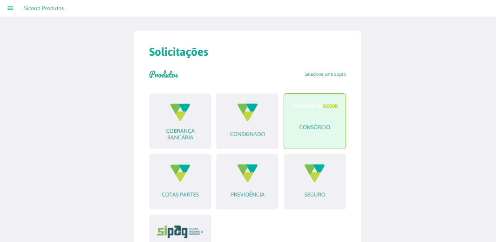
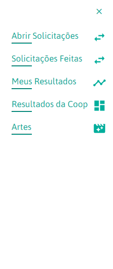
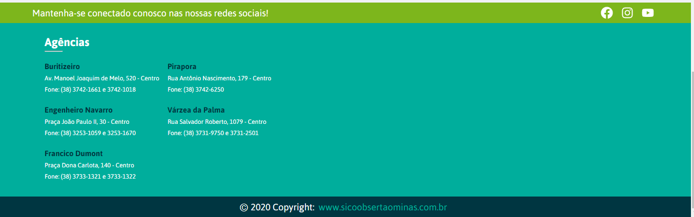

Esse projeto foi desenvolvido com o [Create React App](https://github.com/facebook/create-react-app).

## Descrição do Projeto

A proposta desse projeto é desenvolver uma ferramenta com front-end escrito em ReactJs e Back-End em Spring Boot 
para obtenção de conhecimento sobre as ferramentas e ajudar o Sicoob Sertão Minas a criar uma ferramenta que auxilie 
na gestão de venda e suporte relacionado aos seus produtos como Consórcio, Sipag, Previdências, Seguros, Consignados...

`Atualmente a gestão de vendas da cooperativa é feita em complicadas e desorganizadas planilha Excel.`

<h3>Página Inicial</h3> 

 
**Página Home** 

 
**Menu Lateral (Drawer)** 

 
**Footer** 

##Principais Tecnologias

<ul>
<li> React
<li> Spring Boot
</ul>

<h4>Components
</h4>
<ul>
<li> Header
<li> Progress Bar - Barra de Progresso Acionada no click da logo Sicoob Produtos para voltar à Home
<li> Product - Lista de Produtos da Cooperativa
<li> Footer - Descrição de Contatos e Endereço das Agências do Sicoob Sertão Minas
</ul>

## Entre em contato

[Facebook](https://www.facebook.com/profile.php?id=100008854217598).

[GitHub](https://github.com/samuelg4133).

[Instagram](https://www.instagram.com/samuel.gomesv/?hl=pt-br).

[Linkedln](https://www.linkedin.com/in/samuel-gomes-325175147/).
